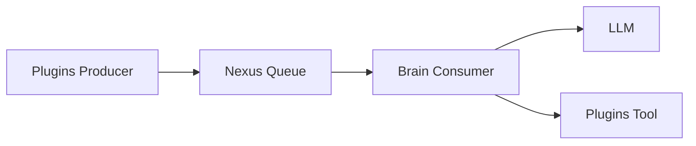

# 2号文档：AIChan 架构文档

## 2.1 当前仓库结构

```text
AIChan/
├─ main.py
├─ cli_server.py
├─ cli_client.py
├─ pyproject.toml
├─ uv.lock
├─ docs/
│  ├─ 0.boundary.md
│  ├─ 1.system-design.md
│  └─ 2.project-structure.md
└─ packages/
   ├─ core/
   ├─ plugins/
   ├─ nexus/
   ├─ brain/
   └─ memory/
```

## 2.2 分层职责
- `core`：基础设施层，提供配置、日志、接口契约与共享实体。
- `plugins`：外设层，负责输入采集（Producer）和工具动作（Tool）。
- `nexus`：中枢层，维护中央 `asyncio.Queue`，承接所有外部信号。
- `brain`：推理层，作为单消费者执行 LLM 推理与工具调用。
- `memory`：记忆层，承接短期/长期记忆扩展。

## 2.3 核心运行拓扑



## 2.4 主链路
1. 外设插件采集输入。
2. 输入通过 `nexus_hub.push_signal(...)` 写入中央队列。
3. `nexus_hub.start_heartbeat()` 持续从队列拉取信号。
4. `Brain` 在单核上下文内完成推理。
5. 推理阶段按需调用插件工具执行动作。

## 2.5 关键模块落点
- `main.py`
  - 组装 `plugins` 与 `brain`。
  - 在生命周期中启动 `nexus_hub.start_heartbeat()`。
  - 启动 `CLIChannelPlugin.start_listening()`。
- `packages/nexus/src/nexus/hub.py`
  - 提供 `push_signal` 和 `start_heartbeat`。
- `packages/plugins/src/plugins/channels/cli.py`
  - 作为 Producer 监听终端输入并入队。
  - 作为 Tool 暴露终端输出能力。
- `packages/plugins/src/plugins/registry.py`
  - 统一注册插件并汇总 `get_tool()`。
- `packages/brain/src/brain/brain.py`
  - 维护推理图与工具调用流程。

## 2.6 运行约束
- 任何输入都必须先入 `Nexus` 队列。
- `Brain` 是唯一 LLM 调用入口。
- 外设插件不做推理，仅做信号采集与动作执行。
- 运行时优先保证顺序一致性和可观测性。
