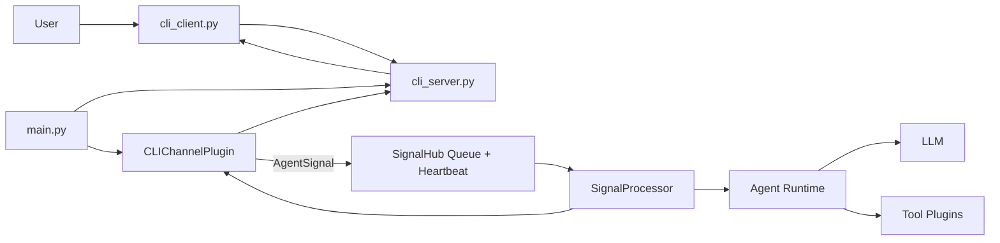

# 2号文档：AIChan 架构文档

## 2.1 当前仓库结构

```text
AIChan/
├─ main.py
├─ cli_server.py
├─ cli_client.py
├─ pyproject.toml
├─ uv.lock
├─ docs/
│  ├─ 0.boundary.md
│  ├─ 1.system-design.md
│  ├─ 2.project-structure.md
│  └─ 3.message-loop.md
├─ core/
├─ plugins/
├─ hub/
├─ agent/
└─ memory/
```

## 2.2 术语对齐

| 代码层模块 | 术语别名 | 说明 |
| --- | --- | --- |
| `core` | 基因组 | 全局实体、接口契约、配置与日志 |
| `plugins` | 感官与外设 | 对外界采集与执行能力的统一边界 |
| `hub` | 中央神经枢纽 | 异步信号缓冲与心跳调度中枢 |
| `agent` | 推理层 | LLM 推理与工具编排入口 |
| `memory` | 海马体 | 记忆检索与长期存储扩展层 |

## 2.3 分层职责
- `core`：共享配置、日志、实体和通用 HTTP 客户端。
- `plugins`：统一承载工具能力与通道能力。
- `hub`：统一信号队列和 heartbeat 消费。
- `agent`：执行 LLM 推理与工具调用。
- `memory`：记忆扩展层。
- `cli_server`：独立外部聊天服务，维护消息和未读状态。
- `cli_client`：独立终端客户端，只与 `cli_server` 通信。

## 2.4 核心运行拓扑



## 2.5 主链路
1. `main.py` 组装插件与 `SignalProcessor`，在运行时实例化 `SignalHub(signal_processor=...)` 并启动 heartbeat。
2. `main.py` 在子线程启动 `cli_server`（固定监听 `127.0.0.1:8765`）。
3. `main.py` 通过 `PluginRegistry.get("cli")` 获取插件并创建 `CLIUnreadPoller(cli_channel=..., signal_hub=..., interval_seconds=...)`，再执行 `start()` 启动轮询线程。
4. plugin 内部检查 AI 侧未读状态，若有未读则触发 `AgentSignal(channel=cli)` 入队。
5. `SignalHub` 串行消费信号并调用 `SignalProcessor.process_signal(...)`。
6. `SignalProcessor` 通过 `CLIChannelPlugin.list_messages(...)` 拉取增量消息。
7. plugin 读取外部消息时会触发 `cli_server` 将 AI 侧未读状态更新为已读。
8. `SignalProcessor` 推理后调用 plugin 回写 assistant 消息。
9. `cli_client` 轮询 `cli_server` 获取增量并展示。

## 2.6 关键模块落点
- `main.py`
  - 启动 `SignalProcessor + cli_server`，在运行时创建 `SignalHub` 实例并通过 `CLIUnreadPoller` 管理轮询线程启停。
- `cli_server.py`
  - 提供 `health/status/messages` API。
  - 维护双对象（`ai/user`）未读状态。
- `cli_client.py`
  - 独立控制台客户端，发送 user 消息并拉取 ai 回复。
- `plugins/src/plugins/channels/cli.py`
  - 对接外部协议并统一映射为内部 `ChannelMessage`。
  - 提供 `emit_signal_if_ai_unread(...)` 供 `hub` 轮询模块触发信号。
- `hub/src/hub/cli_unread_poller.py`
  - 解析 CLI 通道插件，接收 `signal_hub` 依赖注入，并管理未读轮询线程的启动/停止。
- `hub/src/hub/signal_hub.py`
  - 统一信号队列与 heartbeat 消费。
- `hub/src/hub/signal_processor.py`
  - 拉取消息、调用 `agent.Agent`、写回回复。

## 2.7 运行约束
- `agent.Agent` 是唯一 LLM 调用入口。
- `cli_server` 不负责信号推送，只负责状态与消息 API。
- 发送信号职责在 AIChan 侧 plugin/hub 轮询逻辑。
- 通道插件负责外部协议到内部协议的统一映射。
