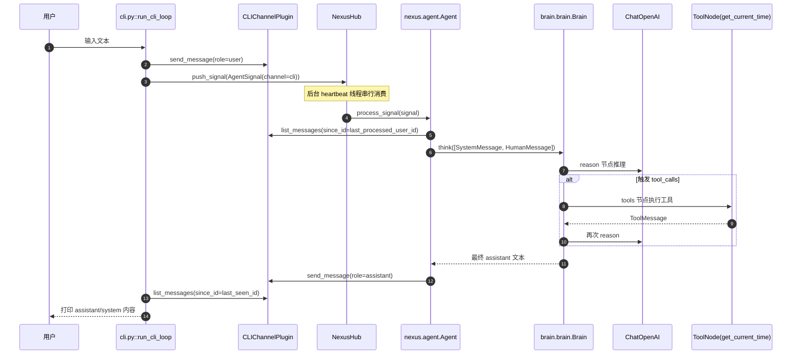

# 3号文档：AIChan 消息收发闭环文档

## 3.1 文档目标
本文只描述“当前代码已落地”的消息发送与接收闭环，不讨论理念，不展开历史迁移。

关注范围：
- 用户输入如何进入系统（发送链路）。
- `NexusHub` 如何做统一入队与消费调度。
- `Agent` 如何消费消息并驱动 `Brain` 推理。
- `Brain` 内部“推理 -> 工具 -> 再推理”的子闭环。
- 推理结果如何回写通道并被 CLI 增量显示（接收链路）。

## 3.2 闭环总览

## 3.3 启动阶段（闭环前置条件）
`main.py` 完成闭环所需的四件事：

1. `register_plugins()`：
- 清空 `PluginRegistry`。
- 注册 `CLIChannelPlugin`（通道）。
- 注册 `CurrentTimeToolPlugin`（工具）。

2. `build_agent()`：
- 初始化 `ChatOpenAI`。
- 用 `PluginRegistry.all_tools()` 收集工具并构建 `Brain`。
- 创建 `Agent(brain=brain)`。

3. `nexus_hub.bind_agent(agent)`：
- 把信号消费目标绑定到 `Agent`。

4. `nexus_hub.start_heartbeat()`：
- 启动后台心跳线程，持续消费队列信号。
- CLI 仅入队，不再直接调用 `Agent`。

## 3.4 发送链路（用户 -> 系统）

### 3.4.1 输入采集与入通道
在 `run_cli_loop` 中，每轮交互读取 `input()`：
- 空输入：直接提示并跳过，不入队。
- 非空输入：执行 `send_channel_message(channel, role="user", content=text)`。

`CLIChannelPlugin.send_message()` 会：
- `strip()` 清理文本。
- 校验 `content` 非空。
- 校验 `role` 属于 `user/assistant/system`。
- 分配递增 `message_id` 并写入 `_messages` 列表。

### 3.4.2 发信号入队
写入 user 消息后，CLI 调用：
- `hub.push_signal(AgentSignal(channel=channel.name))`

此时只保证“入队成功”，不保证当前轮立即得到回复。

## 3.5 调度链路（NexusHub）

`NexusHub` 提供统一的生产者-消费者闭环：

1. 生产者接口：
- `push_signal(signal)` 将 `AgentSignal` 放入线程安全队列。

2. 消费者循环：
- `start_heartbeat()` 启动后台线程。
- 循环 `get(timeout=0.1)` 拉取信号。
- 每条信号调用 `agent.process_signal(signal)`。
- 无论成功失败都会 `task_done()`，避免队列状态失真。

3. 停机：
- `stop_heartbeat()` 设置停止标志并等待线程退出。

关键语义：`NexusHub` 串行消费信号，统一承接所有入口的推理触发。

## 3.6 编排处理链路（Agent）

`Agent.process_signal()` 内部流程：

1. `_resolve_channel(signal.channel)`：
- 从 `PluginRegistry` 取插件。
- 必须是 `ChannelPlugin`，否则抛错。

2. 读取通道游标：
- `last_processed_id = _last_processed_user_message_id.get(channel, 0)`。

3. 拉取消息并过滤：
- `messages = channel.list_messages(since_id=last_processed_id)`。
- 只消费 `role == "user"` 且 `message_id > last_processed_id` 的消息。

4. 逐条推理与回写：
- `brain.think([SystemMessage, HumanMessage])`
- `channel.send_message(role="assistant", content=reply)`
- 更新 `_last_processed_user_message_id[channel]`

因此，assistant/system 消息不会再次触发推理。

## 3.7 推理子闭环（Brain 内部）

`Brain` 是唯一推理入口，内部由 LangGraph 图执行：

1. `reason` 节点：
- 调用 `self.llm.invoke(state["messages"])` 返回 `AIMessage`。
- 异常时返回兜底 `AIMessage`，不中断主流程。

2. `route` 判断：
- 若 `AIMessage.tool_calls` 非空，进入 `tools` 节点。
- 否则结束（`END`）。

3. `tools` 节点（可选）：
- 执行 `ToolNode(self.tools)`。
- 执行后回到 `reason`，直到无工具调用为止。

因此单轮推理闭环为：
- `reason -> tools -> reason -> ... -> END`

## 3.8 接收链路（系统 -> 用户）

CLI 通过 `flush_channel_updates(channel, since_id)` 增量刷新：

1. 拉取：
- `channel.list_messages(since_id=last_seen_id)`。

2. 过滤显示：
- 只打印 `role != "user"` 的消息。

3. 推进游标：
- `last_seen_id = max(message_id)`。

当前实现采用“轮询式刷新”：
- 每轮进入输入前先刷一次。
- 每次入队后再刷一次。

所以 CLI 语义是“异步入队 + 增量显示”，不是严格一问一答阻塞。

## 3.9 状态推进（避免重复/漏处理）

当前闭环依赖四层状态：

1. 通道消息状态（`CLIChannelPlugin`）
- `_messages`：完整消息历史。
- `_next_message_id`：递增 ID。
- `_lock`：跨线程并发读写保护。

2. Hub 队列状态（`NexusHub`）
- `signal_queue`：待消费信号队列。
- `_is_running` / `_stop_event`：生命周期状态。

3. Agent 消费游标（按通道）
- `_last_processed_user_message_id[channel]`。

4. CLI 展示游标
- `last_seen_id`（`run_cli_loop` 局部变量）。

## 3.10 异常与边界行为

### 3.10.1 输入与入队侧
- 用户空输入：不写消息、不发信号。
- `send_message` 内容非法：抛 `ValueError`，CLI 捕获并提示。
- Hub 未启动时 `push_signal`：抛 `RuntimeError`。

### 3.10.2 调度侧
- `NexusHub` 未绑定 `Agent` 时启动心跳：抛 `RuntimeError`。
- 心跳消费中任一信号处理失败：记录异常日志，不中断后续信号消费。

### 3.10.3 推理侧
- LLM 调用失败：`Brain.reason` 返回兜底 `AIMessage`，链路可继续。

### 3.10.4 退出行为
- CLI 收到 `KeyboardInterrupt` / `EOFError`：结束交互循环。
- `main.py` 的 `finally` 块会调用 `nexus_hub.stop_heartbeat()`。

## 3.11 一轮交互示例（ID + 队列视角）
假设首次输入“现在几点”：

1. 写入通道：
- `message_id=1, role=user`

2. 入队信号：
- `AgentSignal(channel="cli")` 入 `signal_queue`

3. Hub 消费并回写：
- 调用 `Agent.process_signal(...)`
- 生成 `message_id=2, role=assistant`

4. CLI 增量刷新：
- `since_id=0` 拉到 `[1,2]`
- 跳过 user（1），显示 assistant（2）
- 更新 `last_seen_id=2`
