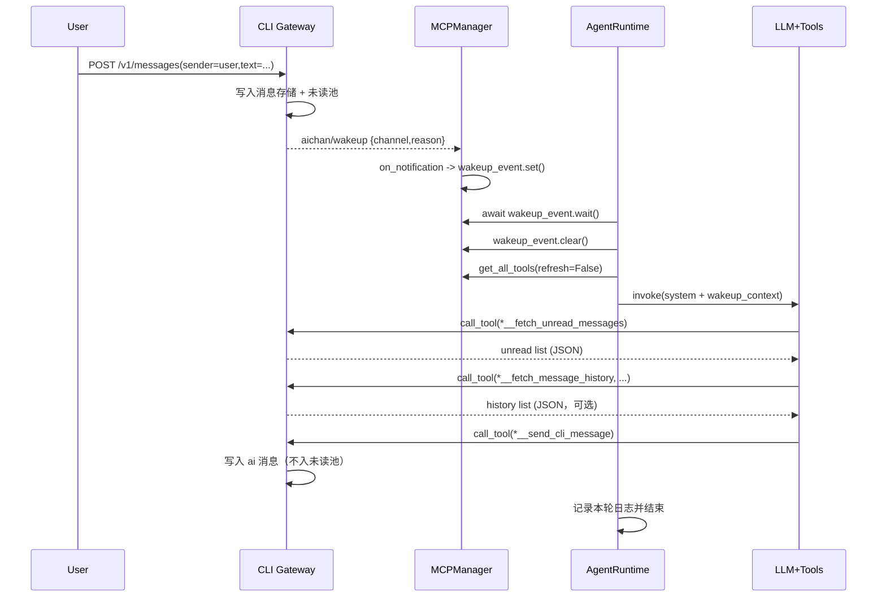

# 3号文档：运行时流程与故障语义

## 3.1 文档目标

本文件描述从“用户发消息”到“Agent 回复落地”的完整运行时行为，包含：

1. 正常时序；
2. 事件驱动语义；
3. 异常场景处理；
4. 观测点与排障入口。

该文档可单独用于开发、联调与故障定位。

## 3.2 正常时序（单消息）

## 3.3 事件驱动语义

### 无轮询挂起

`AgentRuntime` 在循环中通过 `await wakeup_event.wait()` 无消耗挂起。  
收到唤醒后立即 `clear()`，然后启动一轮工具闭环。

### 消息真相来源

即使通知频繁到达，**新增消息真相始终来自 `fetch_unread_messages`**，不是来自通知载荷。  
事件只承担唤醒，不承担内容传输。  
若模型需要补充上下文，可额外调用 `fetch_message_history` 查询分页历史。

## 3.4 工具调用语义

### 首步拉取约束

系统提示强制第一步调用 `*__fetch_unread_messages`。  
运行时会审计第一条工具调用是否满足该规则并输出 warning。

### 历史补充约束

`fetch_message_history` 仅用于补充上下文，不替代首步未读拉取。  
推荐在 `fetch_unread_messages` 之后按需调用，并合理设置 `page_size` 控制上下文体积。

### 用户可见输出约束

1. 仅 `send_*` 工具调用会产生用户可见输出；
2. 如果本轮无 `send_*` 调用，运行时记录内心独白后静默结束；
3. 不执行“纯文本自动转发”兜底。

## 3.5 网关未读语义

### 入池规则

1. `sender == "user"`：进入未读池；
2. `sender == "ai"`：不进入未读池。

### 拉取规则

`fetch_unread_messages` 返回所有未读并原子清空。  
这保证了“被拉取后不重复返回”，并减少大脑侧状态复杂度。

## 3.6 异常处理策略

### Gateway 广播失败

行为：

1. 记录 warning；
2. 移除失效会话；
3. 不回滚消息写入。

影响：可能导致某次唤醒丢失；后续消息仍可继续唤醒。

### Hub 通知载荷异常

行为：

1. 只要 method 是 `aichan/wakeup` 就触发唤醒；
2. 若 `params/channel/reason` 缺失，按 `unknown` 记录观测字段；
3. 不中断其他会话。

### Runtime 推理失败

行为：

1. 捕获异常并记录 error；
2. 当前批次终止；
3. 主循环继续等待下一次唤醒。

### MCP Server 不可用

行为：

1. `MCPManager.start()` 在强依赖配置下启动失败即中断应用；
2. 可选服务（若配置为 `required=False`）可降级跳过。

## 3.7 可观测性与排障入口

### 健康检查

`GET /health` 关注字段：

1. `mcp_server_count`
2. `mcp_tool_count`
3. `wakeup_event_is_set`
4. `last_wakeup`

### 关键日志关键词

1. `🔔 [MCPHub] 收到唤醒通知`
2. `🧾 [AgentRuntime] LLM 输入`
3. `🛠 [AgentRuntime] LLM 请求工具`
4. `🧠 [AgentRuntime] 本轮无 send_* 工具调用`
5. `✅ [AgentRuntime] 本轮完成`

### 常见问题定位

1. 收不到回复：
   检查是否有 `aichan/wakeup` 日志；若无，先查网关广播。
2. 有唤醒但不回复：
   检查是否有 `fetch_unread_messages` 与 `send_*` 工具调用。
3. 事件长时间不触发：
   检查 `last_wakeup` 是否更新，以及网关是否成功发送自定义通知。
