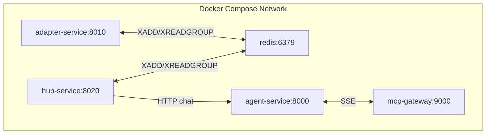

# aichan

本文档用于描述 AICHAN 项目的整体结构与模块关系，聚焦系统分层、职责边界与运行链路，不展开代码实现细节。

## 项目概览

AICHAN 由三个核心服务组成：

- `adapter-service`：QQ 协议适配与桥接层（OneBot v11 入口、消息过滤、MCP 工具暴露）。
- `hub-service`：业务编排中枢（提醒聚合、触发 agent、回写消息）。
- `agent-service`：对话决策与工具调用执行层（LLM 推理、MCP 工具调用）。

项目采用 `uv workspace` 管理多包，服务间通过 HTTP 与 Redis Streams 解耦通信。

## 模块职责

### `adapter-service`

- 接入任意符合 OneBot v11 的外部实现（反向 WebSocket）。
- 过滤并标准化 QQ 事件，写入 Redis `qq.events`。
- 消费 Redis `qq.actions` 并通过 OneBot action 回写 QQ。
- 提供 MCP 工具能力（如历史消息查询）供 `agent-service` 通过 MCP Gateway 调用。

### `hub-service`

- 消费 `qq.events` 提醒事件（当前以私聊为主）。
- 组织“提醒 -> agent -> 回复动作入队”主链路。
- 作为流程中枢保持业务编排简洁，不承载模型推理逻辑。

### `agent-service`

- 提供 `/chat` 对话入口。
- 管理会话上下文与串行策略。
- 启动时通过 MCP Gateway 拉取工具信息（tool metadata/schema），作为本轮推理可用工具集。
- 调用 LLM 生成回复，并在需要时通过 MCP Gateway 调用工具。

## 服务关系图

```mermaid
flowchart LR
    U[QQ 用户] --> N[OneBot v11 实现]
    N <-->|Reverse WS（事件 + 动作）| A[adapter-service]
    A -->|XADD qq.events| R[(Redis Streams)]
    R -->|XREADGROUP qq.events| H[hub-service]
    H -->|HTTP /chat| G[agent-service]
    H -->|XADD qq.actions| R
    R -->|XREADGROUP qq.actions| A
    G -->|SSE / MCP| M[MCP Gateway]
    M -->|docker:// 工具容器| T[Tool Servers]
    N --> U
```

## 部署拓扑图（Compose 视角）

## 核心业务链路（私聊场景）

1. 用户私聊消息进入 OneBot v11 实现。
2. `adapter-service` 接收并过滤事件，写入 Redis `qq.events`。
3. `hub-service` 消费事件并按会话调度，调用 `agent-service /chat` 请求生成回复。
4. `agent-service` 基于 MCP Gateway 提供的工具信息进行工具决策，并在推理过程中按需调用 MCP 工具。
5. `hub-service` 将回复写入 Redis `qq.actions`，由 `adapter-service` 消费后回写到 QQ。

## 文档分工

- 本文档：系统级结构与模块关系。
- `docs/agent-service.md`：agent 服务职责、配置、运行方式。
- `docs/adapter-service.md`：适配层协议与接口约束。
- `docs/hub-service.md`：中枢编排职责与链路契约。
