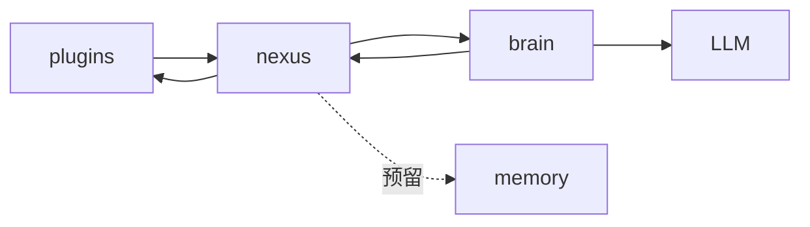

# AIChan 项目结构详解

本文档只描述当前代码结构与实现落点。  
系统设计动机与分层原则请看：[system-design.md](system-design.md)。

## 1. 当前仓库结构

```text
AIChan/
├─ main.py
├─ cli_server.py
├─ cli_client.py
├─ pyproject.toml
├─ uv.lock
├─ .env
├─ .env.example
├─ README.md
├─ docs/
│  ├─ project-structure.md
│  └─ system-design.md
└─ packages/
   ├─ core/
   │  ├─ pyproject.toml
   │  └─ src/core/
   │     ├─ __init__.py
   │     ├─ config.py
   │     ├─ entities.py
   │     ├─ interfaces.py
   │     ├─ logger.py
   │     └─ py.typed
   ├─ plugins/
   │  ├─ pyproject.toml
   │  └─ src/plugins/
   │     ├─ __init__.py
   │     ├─ base.py
   │     ├─ registry.py
   │     ├─ channels/
   │     │  ├─ __init__.py
   │     │  └─ cli.py
   │     ├─ tools/
   │     │  ├─ __init__.py
   │     │  └─ time_tool.py
   │     └─ py.typed
   ├─ nexus/
   │  ├─ pyproject.toml
   │  └─ src/nexus/
   │     ├─ __init__.py
   │     ├─ agent.py
   │     └─ py.typed
   ├─ brain/
   │  ├─ pyproject.toml
   │  └─ src/brain/
   │     ├─ __init__.py
   │     ├─ brain.py
   │     └─ py.typed
   └─ memory/
      ├─ pyproject.toml
      └─ src/memory/
         ├─ __init__.py
         ├─ store.py
         └─ py.typed
```

## 2. 模块职责

- `core`：共享基础层，提供配置管理、日志、接口契约与通用实体定义。
- `plugins`：插件层，统一承载交互渠道（channels）和工具能力（tools），通过注册表暴露能力。
- `nexus`：编排层，负责上下文拼接、请求调度、调用 `brain/plugins` 并回传结果。
- `brain`：推理层，负责 LLM 推理、工具调用决策和结果生成。
- `memory`：记忆层占位模块，后续补充详细方案与实现。

## 3. 架构调用关系



关系约束：

- 调用关系图表示运行时职责，不等同于 Python 导入依赖图。
- `brain` 是唯一允许直接调用 `LLM` 的模块。
- `plugins`、`brain` 由 `nexus` 统一编排；`memory` 目前仅占位未启用。
- `brain` 的处理结果必须先回传 `nexus`，再由 `nexus` 进行最终路由。

## 4. 进程与运行拓扑

当前 CLI 对话采用“服务端 + 客户端”双进程模式：

1. 服务端启动器：`main.py`，负责模块组装（plugins/brain/nexus）并启动 `uvicorn`。
2. 服务端接口：`cli_server.py`（FastAPI），对外提供 `/chat` 等接口，不承担模块组装。
3. 客户端：`cli_client.py`，负责终端输入输出，并通过 HTTP 调用服务端。
4. 服务端内部：`cli_server.py -> nexus -> (brain / plugins)`。

## 5. 关键文件映射

| 模块 | 主要文件 | 当前状态 |
| --- | --- | --- |
| `core` | `packages/core/src/core/config.py`、`packages/core/src/core/interfaces.py`、`packages/core/src/core/logger.py` | 已落地并在多包复用 |
| `plugins` | `packages/plugins/src/plugins/registry.py`、`packages/plugins/src/plugins/channels/cli.py`、`packages/plugins/src/plugins/tools/time_tool.py` | 已落地，支持能力注册与默认工具 |
| `nexus` | `packages/nexus/src/nexus/agent.py` | 已落地，承担统一编排入口 |
| `brain` | `packages/brain/src/brain/brain.py` | 已落地，负责推理与工具调用策略 |
| `memory` | `packages/memory/src/memory/store.py` | 占位中，暂未启用具体实现 |


