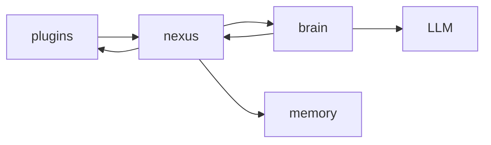

# AIChan 系统设计思路

本文档描述系统分层原则与架构约束，强调“为什么这样设计”。  
工程现状请看：[project-structure.md](project-structure.md)。

## 1. 设计前提：I/O 总线统一

在计算机架构里，键盘（输入）和打印机（输出）都挂在同一个 I/O 总线上，统称插件。  
同理，AIChan 将 `receptors`（输入）与 `effectors`（动作）合并为 `plugins`（插件层）。

目标不是“按输入/输出分类”，而是“按能力注册与调用”统一管理。

## 2. 目标分层模型

- `core`：基础能力（配置、日志、接口契约、数据模型）
- `plugins`：插件总线（渠道 + 工具 + 统一注册）
- `nexus`：中枢编排（上下文组织、队列调度、结果路由）
- `brain`：推理决策（唯一 LLM 交互层）
- `memory`：记忆存取（长期/短期记忆）

## 3. plugins 目录设计

```text
packages/plugins/src/plugins/
├── base.py         # 通用抽象基类（BasePlugin）
├── registry.py     # 全局插件注册表（单例）
├── channels/       # 交互类插件（CLI, WeChat, QQ）
└── tools/          # 功能类插件（FileSeeker, SysExecutor）
```

## 4. 能力注册机制（PluginRegistry）

核心思想：任何能力，无论是“听”（channel）还是“做”（tool），都注册到同一总线。

```python
# packages/plugins/src/plugins/registry.py

class PluginRegistry:
    _pool = {}

    @classmethod
    def register(cls, instance):
        """不管你是 Channel 还是 Tool，统统注册进来"""
        cls._pool[instance.name] = instance

    @classmethod
    def get(cls, name: str):
        return cls._pool.get(name)

    @classmethod
    def all_tools(cls):
        """给 LLM 返回所有可用的“技能清单”"""
        return [
            p.to_tool_schema()
            for p in cls._pool.values()
            if hasattr(p, "to_tool_schema")
        ]
```

## 5. 架构调用关系（目标）



约束：

- 只有 `brain` 可以调用 `LLM`。
- `memory`、`plugins`、`brain` 都由 `nexus` 统一调度。
- `brain` 的结果必须回传给 `nexus`，由 `nexus` 负责最终回路由。

## 6. 合并后的优势

1. 技能平等
   `brain` 看到的都是能力调用，不区分“感知”还是“动作”。
2. 扩展极简
   新增能力只需实现类并注册到 `PluginRegistry`。
3. 支持双工插件
   同一插件可同时接收输入并执行动作（Duplex），无需跨包通信。

## 7. 目标数据流（神经反射）

1. 用户通过 `plugins/channels` 输入消息（例如 CLI）。
2. `nexus` 接收消息并从 `memory` 拉取上下文切片。
3. `nexus` 将标准化上下文交给 `brain`。
4. `brain` 调用 `LLM` 推理，必要时通过能力调用触发 `plugins/tools`。
5. `brain` 将结果回传 `nexus`。
6. `nexus` 将结果路由回对应 `plugins/channels` 输出。

## 8. 迁移说明

- `receptors` 与 `effectors` 的职责已合并到 `plugins`。
- 仓库中旧包已移除，当前统一以 `plugins` 作为插件层实现与扩展入口。


